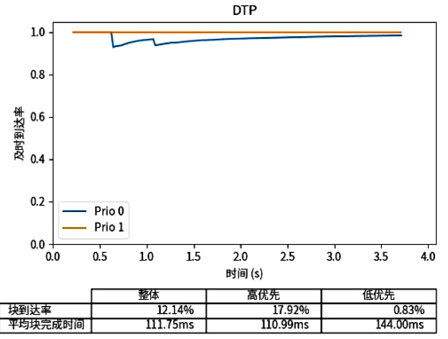

# dtp-test-script

保存了一些可以用在 DTP 相关项目上的测试脚本

## Prerequisites

### python

python >= 3.10

### pdm

一种 python 的包管理工具，可以更加轻松地 python 项目。

```shell
pip install pdm
```

### 安装依赖

```shell
pdm install
```

## Usage

### 综合性数据分析与绘图 analyze.ipynb

使用该笔记本可以解析客户端打印的`.csv`格式的数据输出，并结合发送端使用的 trace file 来进行对比图像的绘制。目前绘制的图像功能并不完全完善，需要后续继续增加。

该文件中包含多个函数，可以用来进行文件内容解析操作等，如果有需要可以考虑从此文件中复制部分代码片段进行使用。

请参考笔记本中的区域标题以及测试用输出进行使用。

客户端数据的文件格式要求使用 .csv 文件并且使用`,`进行数据分割，一个样例如下：

```csv
block_id,bct,size,priority,deadline,duration
5,29,1235,1,200,37731
13,31,1435,1,200,65654
17,30,1475,1,200,75731
9,56,288555,2,200,80614
25,30,1210,1,200,106874
21,40,53910,2,200,107636
29,30,1205,1,200,119860
37,32,1195,1,200,152892
33,46,53735,2,200,158632
41,30,1255,1,200,164867
49,31,1625,1,200,196674
53,30,1450,1,200,210596
61,32,1240,1,200,241230
65,32,1250,1,200,256600
73,33,1220,1,200,286325
```

注：处理的时候默认会将 block_id 转换为自然数序列\[0,1,2...\]，如果不需要这个操作请修改`parse_result`函数。

### 生成新的测试 trace: gen_trace.py

1. 在 `config` 中添加 json 格式的配置文件，一个文件表示一组类似的 trace
2. 在命令行执行 `pdm run gen_trace config/<config_name>.json`

配置格式如下：

```json
[
  {
    "block_num": 1000,
    "block_size": 1300,
    "block_gap": 0.001,
    "block_ddl": 200,
    "block_prio": 0,
    "trace_file_name": "trace_1300_1ms_1000.txt"
  }
]
```

其中 `block_size`, `block_gap`, `block_ddl` 与 `block_prio` 有三种不同的生成方法：

- 统一数值：所有的块都是用同样的数值，只需要在字段中给出即可，例如 `"block_ddl": 200` 
- 随机数值：在字段中使用类似以下的格式进行随机数据生成的配置
  ```json
  {
    "block_prio": {
      "type": "random",
      "random": {
        "seed": 2022,
        "distribution": "integers",
        "max": 3
      }
    }
  }
  ```
  其中 `seed` 为必须提供的字段，其他的字段根据随机的方法不同而有所区别。具体的写法请参考 `gen_trace.py:generate_random` 函数的具体实现。
- 顺序循环：在给出的若干值中循环，使用方法参考下面的格式

  ```json
  {
    "block_prio": {
      "type": "seq",
      "seq": [1, 2, 2]
    }
  }
  ```

## 实时统计画图工具 liveshow/liveshow_tunnel.py

### liveshow.py

可以通过实时解析 client 和 server 生成的数据来绘制图像。

#### 基本用法

在数据接收端运行命令：

```shell
python liveshow.py -t trace.txt -r result.csv --title "Live Show"
```

即可绘制实时图像，图像类似下图所示：



其中 `trace.txt` 是发送端的 trace file，result.csv 是客户端生成的 csv 。格式请参考[综合性数据分析与绘图](#综合性数据分析与绘图-analyze.ipynb)中给出的样例。

注意：这个脚本只能绘制只有两个优先级并且优先级分别为 0, 1 的 trace file

如果需要进行数据的对比，那么需要同时运行两个程序。

#### playback 功能

liveshow.py 允许非实时地生成 .gif 文件来展示发送的过程。为了实现这件事，我们需要得到发送端的数据发送与丢弃信息。

首先，发送端需要先生成类似如下的文件：

```txt
block_id,status,duration
5,start,22985
[INFO] quiche: stream 5 send complete,25281
9,start,40625
13,start,49044
[INFO] quiche: stream 13 send complete,50875
17,start,60118
21,start,82315
25,start,92145
[INFO] quiche: stream 25 send complete,93612
29,start,104696
[INFO] quiche: stream 29 send complete,111446
```

然后使用 server_log.py 脚本解析这个文件，形成一个以 .csv.csv 结尾的数据。这个文件中包括每个数据块开始的时间、到达的时间以及丢弃的时间。

使用下面的命令运行脚本：

```shell
python liveshow.py -t trace.txt -r result.csv -s server_log.csv.csv --title "Live Show" --playback
```

这会开始自动开始播放，直到数据结束。通过修改脚本最后的代码即可将输出保存为 .gif 文件。

#### ！可能问题

无论是基本功能还是 playback 功能，在数据统计上该脚本可能都存在一些问题，主要的问题围绕着：怎么衡量到达数据的按时完成率。请检查这两个功能的统计结果，对其进行完善！

## log2csv脚本使用说明

该脚本可以将测试过程中生成的client.log转换成可以用来绘图的csv文件

### 使用方法
需要python 3.10 以上，安装相关库

`pythone log2csv.py ./data`
只需要指定相关目录即可，会自动到该目录寻找client.log文件。

会在当前目录生成两个文件：
1. blocks.csv
2. stats.csv
### 效果预览
client.log文件格式
```log
peer_addr = 127.0.0.1:5555
test begin!

BlockID  bct  BlockSize  Priority  Deadline
         5         1      1235         1       200
        13         1      1435         1       200
         9        18    288555         2       200
      4253         0      2690         2       200
connection closed, recv=22126 sent=8430 lost=6 rtt=3.547245ms cwnd=14520, total_bytes=29255262, complete_bytes=27969375, good_bytes=27969375, total_time=19804678
```

生成block.csv文件
```csv
BlockID,bct,BlockSize,Priority,Deadline
5,1,1235,1,200
13,1,1435,1,200
9,18,288555,2,200
17,1,1475,1,200
```
生成stats.csv文件
```csv
c_recv,c_sent,c_lost,c_rtt(ms),c_cwnd,c_total_bytes,c_complete_bytes,c_good_bytes,c_total_time(us),qoe,retry_times
22126.0,8430.0,6.0,3.547245,14520.0,29255262.0,27969375.0,9.0,19804678.0,-1,-1
```